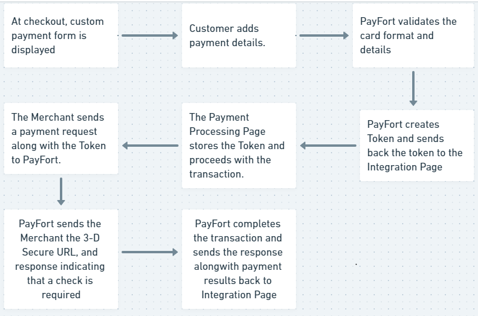
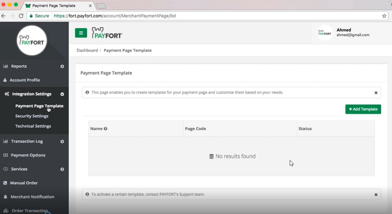
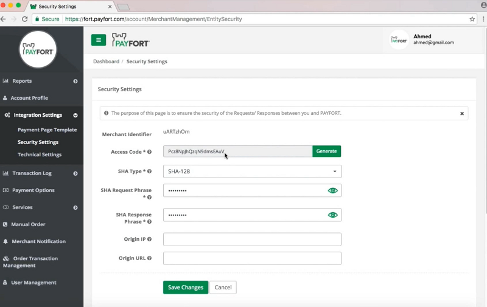

# Use Custom Payment Form

You can also build your own custom payment Form without using default template provided by PayFort.


Figure 1

------

### How it works - overview

1. You develop your own custom payment details form that collects the card details (credit card number, expiry date, CVV), and sends the request to PayFort.
2. PayFort receives the payment details and returns the response which includes the Token to your payment processing page.
3. You use the token to complete the [Authorization or Purchase operation](https://docs.payfort.com/docs/api/build/index.html#operations-request).

 ***Note*** - You should develop a form that does not send data to your website but directly submits the form to PayFort.*

------

### Integration Flow



Figure 2

1. The Customer begins the checkout process on your website.

2. Your website displays the custom payment form to collect the card’s details. Then the Customer enters the card’s details on the payment page.

3. PayFort validates the card format.

4. PayFort creates a token for the card details and sends it back to your payment page.

5. Payment page stores the Token and proceeds with the transaction.

6. Payment page sends a payment request along with the Token to PayFort.

7. PayFort sends the 3-D Secure URL, and response indicating that a check is required:

   1. Payment page redirects the Customer to check his card enrollment.
   2. The Customer enters authentication data.
   3. 3-D Secure authentication is completed and PayFort receives the authentication results.

    ***Note*** - *In this case, PayFort returns* **status “20: On hold”** *and* **message “064: 3-D Secure check requested”**. *For example, PayFort is waiting for the payment page to authenticate the Customer.*

8. PayFort completes the operation based on the 3-D Secure response and returns the response to the website.

9. The payment results are displayed to the Customer.

 ***Note*** -

- *If the Token is sent by the payment page, it will be generated with the same name sent by the website.*

- Payment processing page, payment form and payment details form all refer to payment page on your site where customer will enter card details.

------

## Endpoints

### Live

```
POST https://checkout.PayFort.com/FortAPI/paymentPage
```

### Sandbox 

```
POST https://sbcheckout.payfort.com/FortAPI/paymentPage
```

------

## Before you start

Make sure you have your `access_code`. Refer figure 3. You can find it in the [backoffice](https://fort.payfort.com/account/MerchantManagement/EntitySecurity), under Integration Settings**Security Settings > Access Code**. If you don't have an account with us yet, you can create a test account by visiting the [link]("https://www.payfort.com/test-account/"). You can also get started with an active account by visiting this [link](https://www.payfort.com/get-started/)

------



Figure 2 : Uploading custom template

The Payment Page Template available in the backoffice provides you the feature to create a custom payment processing page. Refer to the figure 2. Once you upload your custom payment page our support team will validate the same.




Figure 3:  Generating Access Code.

------

## Start testing

Ready to try out your integration? Create a test account to get everything working perfectly before going live.<br/><br/>
[<button class="btn btn-primary">Get test account </button>]("https://www.payfort.com/test-account/")

## Add the code snippet to your site

The following code snippet shown here is an example of the start of the payment process. You can refer to this example, replacing the supplied `acccess_code` with your own. The card token will be posted via the URL specified in the form's `action` attribute.

<div class="container">
  <ul class="nav">
    <li class="nav-item">
      <a class="nav-link" href="#htmlcode">HTML</a>
    </li>
    </ul>
<a name=htmlcode></a>
<!DOCTYPE html>
<html lang="en">

```php+HTML
<html>
    
<body>
 <form method="post" action="https://sbcheckout.payfort.com/FortAPI/paymentPage" id=form1 name=form1>
<input type="hidden" NAME="service_command" value="TOKENIZATION">
<input type="hidden" NAME="language" value=" ">
<input type="hidden" NAME="merchant_identifier" value=" ">
<input type="hidden" NAME="access_code" value=" ">
<input type="hidden" NAME="signature" value="">
<input type="hidden" NAME="return_url" value=" ">
<input type="hidden" NAME="merchant_reference" value="">
<input type="hidden" NAME="card_number" value="">
<input type="hidden" NAME="expiry_date" value="">
<input type="hidden" NAME="card_security_code" value="">
<input type="hidden" NAME="card_holder_name" value=" ">
<input type="submit" value="" id="submit2" name="">
</form>
</body>
</html>
```
</div>


------


## How to add the Tokenization service on the Payment Page?

The Tokenization service is applicable to be integrated through the payment page through the below steps:

1. The Customer processes the first PURCHASE/ AUTHORIZATION payment successfully.
2. The payment page will receive a token_name in the response. This token_name should be considered as a permanent token name, and it can be used in the future customer’s payments by submitting the token_name in the next PURCHASE/ AUTHORIZATION payment with card_security_code parameter.
3. No need to open the Payment Details Form to fill all the card details again in the next checkouts.

If the Customer wants to update/ delete his card, you should check [Update Token](https://docs.payfort.com/docs/api/build/index.html#update-token-service) section.

 ***Note***
Please refer to section [FORT Tokenization Service](https://docs.payfort.com/docs/api/build/index.html#fort-tokenization-service) for more details about the token name parameter.

------

## Payment Page Customization

**This is a list with all customizable CSS classes on the basic merchant page:**

- The **`Wrapper`** class: responsible for the total width of the form container and the background.
- The **`Container`** class: responsible for the form’s shape and width.
- The **`Popover`** class: responsible for the error messages.
- The **`Half-container`** class: used to merge the date and CVV fields into one block if needed.
- The **`Input`** class: is the container of each single input field.
- The **`Pay`** class: responsible for the submit button.
- The **`Visa/ MasterCard`** classes: used to change the color of the Visa/ MasterCard colors.

 ***Note*** - You can always create multiple theme files that will enable you to switch freely and easily between them when necessary.

 ***Note***- “Theme” files can be uploaded from the back-office using the Payment Page template screen.

------

## Need further help?

Thanks for using PayFort.com. If you need any help or support, then message our support team at [support@payfort.com](mailto:support@payfort.com).