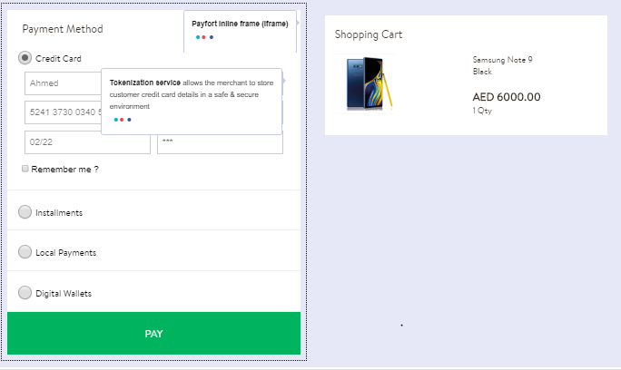
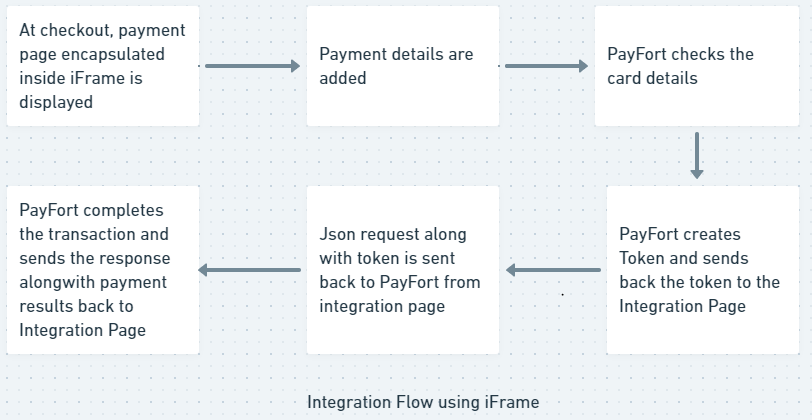

# What is iFrame for Web?

You can setup payment form and start accepting payments within few minutes with the help of iFrame. PayFORT provides easy to use iFrame which can be easily integrated with your payment form. It takes the look and feel of your merchant site and accepts payments from major credit cards including MADA, VISA, Mastercard, etc. You develop your site in any technology of your choice and integrate the iFrame in your html based checkout page. The PayFORT iframe takes the look and feel as that of your website.





Figure 1 - Using PayFORT iFrame for web

------

## How it Works?

1. Your checkout page will display an integrated PayFORT iFrame to your Customer that has the same look and feel as that of your website.

2. Customer fills his/her payment details in the checkout page. 

3. PayFORT server receives the payment details and validates the same.

4. PayFORT then sends a token to your checkout page to complete the transaction.

   <div class="alert alert-info"><i class="fa fa-info">&nbsp;&nbsp;</i>You have the option to redirect the Customer directly to the checkout page.</div>

For more details on Tokens and Tokenization process visit the [link](tokenization.md)

------

## Integration Flow



Figure 2 : Integration Flow using iFrame

Here is the description of the PayFORT iFrame Integration workflow :

<div><ol>
    <li>The customer begins the checkout process on your website.</li>
    <li>The payment page with integrated iFrame is displayed. The Customer then enters the card’s details on the payment page.</li>
    <li>PayFORT checks the card details.</li>
    <li>PayFORT creates a token for the Customer transaction and sends it to the payment page.</li>
    <li>The Payment page then sends a <a href="https://docs.payfort.com/docs/api/build/index.html#merchant-page-operations">JSON request</a> along with the token to PayFORT.</li>
    <li>In case your page receives from PayFORT server a 3-D Secure URL <mark>3ds_url</mark>, and response indicating that a 3ds check is required then:<div class="alert alert-info"><ol><li>Your payment page redirects the Customer to the ACS to check his card enrollment.</li><li>The Customer enters authentication data on the ACS platform.</li><li>The ACS performs authentication of the Customer’s data and sends the authentication results to PayFORT.</li><ol>


        </ol></ol></div></li>
    <li>PayFORT completes the operation based on the 3-D Secure response and returns the response to your payment page.</li>
    <li>PayFORT sends the payment results to your site.</li>
    </ol></div>

<div class="alert alert-info"><i class="fa fa-info">&nbsp;&nbsp;</i>In case of 3ds secure check, PayFort returns status <mark>20: On hold</mark>and message <mark>064: 3-D Secure check requested</mark>message.For example, PayFort is waiting for your payment page to authenticate the Customer.</div>

<div class="alert alert-info"><i class="fa fa-info">&nbsp;&nbsp;</i>If you include the <mark>token_name</mark> parameter in the request and this Token already has a successful Authorization, then the card number (masked) and expiry date will be displayed in their allocated fields.</div>

<div class="alert alert-info"><i class="fa fa-info">&nbsp;&nbsp;</i>If the Token is sent by you, it will be generated with the same name as sent by your page.</div>

<div class="alert alert-info"><i class="fa fa-info">&nbsp;&nbsp;</i>Payment processing page, payment form and payment details form all refer to payment page on your site where customer will enter card details.</div>

For more details on Tokens and Tokenization process visit the [link](tokenization.md)

------

##    Give It a Try

Use one of our [test cards](testing.md) and corresponding CVV to try iFrames out for yourself. 

You can use any expiry date (`mm/yy`), as long as it's in the future.

------

### Endpoints

An **endpoint** is one end of a communication channel and your merchant site will communicate with the PayFORT resources using Endpoints. For PayFORT <mark>APIs</mark>, an **endpoint** includes a URL of PayFORT server or service. 

**Sandbox**

```http
POST https://sbcheckout.payfort.com/FortAPI/paymentPage
```

**Live**

```http
POST https://checkout.payfort.com/FortAPI/paymentPage
```


------

## Integrate iFrames to Payment Page

If you are planning to use PayFORT iFrames then you can use the endpoints&nbsp;[<i class="fa fa-anchor"></i>](#endpoints) for testing and and also for going live. You can use programming language of your choice or what your site uses and can use the iFrame in your html based check out page.


------

**Before you start**

Make sure you have your `access_code`. Refer to Figure 2 [<i class="fa fa-link"></i>](#figure2). You can find it in the [backoffice](https://fort.payfort.com/account/MerchantManagement/EntitySecurity), under Integration Settings > **Security Settings > Access Code**. If you don't have an account with us yet, you can create a test account by visiting the [link]("https://www.payfort.com/test-account/"). You can also get started with an active account by visiting this [link](https://www.payfort.com/get-started/). Once you signup you will get the access to the Backoffice. You can check out more about navigating through backoffice by visiting this [link](backoffice.md).


<a name="figure2"></a><br/>


Figure 2 : Access Code Generation

The Payment Page Template available in the backoffice provides you the feature to create a payment processing page using PayFort iFrame. Refer to the Figure 3  [<i class="fa fa-link"></i>](#figure3)


<a name="figure3"></a><br/>


Figure 3 : Use Payment Settings to create a payment form

------

**Sample iFrame code snippet**

The following sample code snippet is the start of the payment process and allows you to tokenize a customer's sensitive card information using iFrames.     


```html
<html>
   </head>
<body>
<iframe  style="border:5px dotted red" name="myframe" src = "" width="400" height="600">
</iframe>
<form action="https://sbcheckout.payfort.com/FortAPI/paymentPage" method="post" id="" target="myframe">
 
<INPUT type="hidden" NAME="service_command" value="TOKENIZATION">

<INPUT type="hidden" NAME="language" value=" ">

<INPUT type="hidden" NAME="merchant_identifier" value="">

<INPUT type="hidden" NAME="access_code" value="">

<INPUT type="hidden" NAME="signature" value="">

<INPUT type="hidden" NAME="return_url" value="">
 
<INPUT type="hidden" NAME="merchant_reference" value="">

<input value="Send" type="submit" id="form1">

</form>
</body>

</html>
```

------

The above code snippet is an HTML based form that will post a request to PayFORT server. The request parameters are also added in the input tag of the code. 

<div class="alert alert-info">&nbsp;&nbsp;<i class="fa fa-info">&nbsp;&nbsp;</i>The parameters are mandatory and are required by PayFORT server to validate, authenticate and provide the tokens for processing of payment</div>

For more details on Tokens and Tokenization process visit the [link](tokenization.md)

## Go to Full API

------

Check out our full API by visiting this [link](https://docs.payfort.com/docs/api/build/index.html#redirection)

## Need further help?

Thanks for using PayFort.com. If you need any help or support, then message our support team at [support@payfort.com](mailto:support@payfort.com).