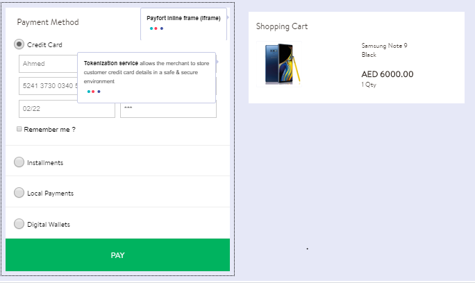
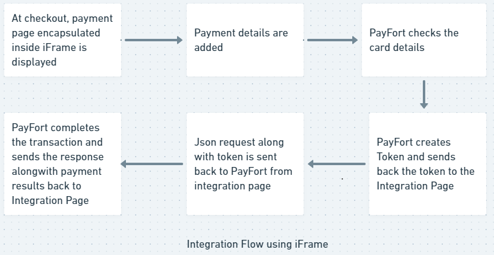

# Get Started With PayFORT

------

If you are starting out a new ecommerce or any other merchant site then you need a robust payment system that can capture not only customer's payment details but also helps you with various financial transactions needs of your customers such as recurring payments, financing purchase by the customer, one time payment etc. PayFORT helps you to build a robust payment system for your merchant site. With the help of PayFORT you can collect payment information conveniently and securely. It offers your customer the choice to pay in multiple currencies. Your customers can also select from available payment methods such as 3D secure, Apple Pay, Visa Checkout or MasterPass. 

You can get started with a PayFORT test account by signing up using this [link](https://www.payfort.com/test-account/)

If you want to integrate payment systems with your site then you can sign up for a live account by visiting this [link](https://www.payfort.com/get-started/) 
<h2>Endpoints</h2><hr>

<p>An <em>endpoint</em> is one end of a communication channel and your merchant site will communicate with the PayFORT resources using Endpoints. For PayFORT <mark>APIs</mark>, an <em>endpoint</em> includes a URL of PayFORT server or service. </p>

**Sandbox**

```http
POST https://sbcheckout.payfort.com/FortAPI/paymentPage
```

**Live**

```http
POST https://checkout.payfort.com/FortAPI/paymentPage
```
<h2>Give It a Try</h2>
<hr>

<p>Use one of our <a href ="testing.md">test cards</a> and corresponding CVV to try iFrames out for yourself. </p>

<p>You can use any expiry date (`mm/yy`), as long as it's in the future.</p>

PayFORT offers you two approaches for integrations with your merchant site as mentioned below:
<h2>Merchant Page Integration</h2>
<div class="container">

  <p>There are two ways to integrate Merchant pages</p>


  <ul class="nav nav-tabs">
    <li class="active"><a data-toggle="tab" href="#merchant-page-1">Merchant Page 1</a></li>
    <li><a data-toggle="tab" href="#merchant-page-2">Merchant Page 2</a></li>

  </ul>


  <div class="tab-content">
    <div id="home" class="tab-pane fade in active">

</div>
    <div id="merchant-page-1" class="tab-pane fade">
        </br>
     <h3>What is iFrame for Web?</h3> 
     <hr>
    <p>
        You can setup payment form and start accepting payments within few minutes with the help of iFrame. PayFORT provides easy to use iFrame which can be easily integrated with your payment form. It takes the look and feel of your merchant site and accepts payments from major credit cards including MADA, VISA, Mastercard, etc. You develop your site in any technology of your choice and integrate the iFrame in your html based checkout page. The PayFORT iframe takes the look and feel as that of your website.
    </p>

<p>Figure 1 - Using PayFORT iFrame for web</p>

<h3>How it Works?</h3><hr>
<ol>
<li> Your checkout page will display an integrated PayFORT iFrame to your Customer that has the same look and feel as that of your website.</li>
<li>Customer fills his/her payment details in the checkout page.</li>
<li>PayFORT server receives the payment details and validates the same.</li>
<li>PayFORT then sends a token to your checkout page to complete the transaction.</li></ol>

   <div class="alert alert-info"><i class="fa fa-info">&nbsp;&nbsp;</i>You have the option to redirect the Customer directly to the checkout page.</div>
<p>For more details on Tokens and Tokenization process visit the 
<a href="tokenization.md">Link</a></p>


<h3>Integration Flow</h3>
<hr>



<p>Figure 2 : Integration Flow using iFrame</p>

<p>Here is the description of the PayFORT iFrame Integration workflow :</p>

<ol>
    <li>The customer begins the checkout process on your website.</li>
    <li>The payment page with integrated iFrame is displayed. The Customer then enters the card’s details on the payment page.</li>
    <li>PayFORT checks the card details.</li>
    <li>PayFORT creates a token for the Customer transaction and sends it to the payment page.</li>
    <li>The Payment page then sends a <a href="https://docs.payfort.com/docs/api/build/index.html#merchant-page-operations">JSON request</a> along with the token to PayFORT.</li>
    <li>In case your page receives from PayFORT server a 3-D Secure URL <mark>3ds_url</mark>, and response indicating that a 3ds check is required then:</br></br><div class="alert alert-info">
<ol>
  <li>Your payment page redirects the Customer to the ACS to check his card enrollment.</li>
  <li>The Customer enters authentication data on the ACS platform.</li>
  <li>The ACS performs authentication of the Customer’s data and sends the authentication results to PayFORT.</li>
</ol>
</div>
<li>PayFORT completes the operation based on the 3-D Secure response and returns the response to your payment page.</li>
 <li>PayFORT sends the payment results to your site.</li></br>
<div class="container">
<div class="alert alert-info"><i class="fa fa-info">&nbsp;&nbsp;</i>In case of 3ds secure check, PayFort returns status <mark>20: On hold</mark>and message <mark>064: 3-D Secure check requested</mark><p>message.For example, PayFort is waiting for your payment page to authenticate the Customer.</p></div>

<div class="alert alert-info"><i class="fa fa-info">&nbsp;&nbsp;</i>If you include the <mark>token_name</mark> parameter in the request and this Token already has a successful Authorization,<p> then the card number (masked) and expiry date will be displayed in their allocated fields.</p></div>

<div class="alert alert-info"><i class="fa fa-info">&nbsp;&nbsp;</i>If the Token is sent by you, it will be generated with the same name as sent by your page.</div>

<div class="alert alert-info"><i class="fa fa-info">&nbsp;&nbsp;</i>Payment processing page, payment form and payment details form all refer to payment page on your site <p>where customer will enter card details.</p></div>
</div>
<p>For more details on Tokens and Tokenization process visit the 
<a href="tokenization.md">Link</a></p>


<h3>Integrate iFrames to Payment Page</h3><hr>

<p>If you are planning to use PayFORT iFrames then you can use the endpoints&nbsp;<a href=""#endpoints"><i class="fa fa-anchor">&nbsp;</i></a>Endpoints for testing and and also for going live. You can use programming language of your choice or what your site uses and can use the iFrame in your html based check out page.</p>

<h4>Before you start</h4>

<p>Make sure you have your <mark>access_code</mark>. Refer to Figure 3<a href=#figure-3"><i class="fa fa-link"></i></a>. You can find it in the <a href="https://fort.payfort.com/account/MerchantManagement/EntitySecurity">backoffice</a>, under Integration Settings > <bold>Security Settings > Access Code</bold>. If you don't have an account with us yet, you can create a test account by visiting the <a href="https://www.payfort.com/test-account/">Link</a>. You can also get started with an active account by visiting this <a href="https://www.payfort.com/get-started/">link</a>. Once you signup you will get the access to the Backoffice. You can check out more about navigating through backoffice by visiting this <a href="backoffice.md">link</a></p>

<a name="figure3"></a><br/>


<p>Figure 3 : Access Code Generation</p>

The Payment Page Template available in the backoffice provides you the feature to create a payment processing page using PayFort iFrame. Refer to the Figure 4  <a href="#figure4"><i class="fa fa-link"></i></a>


<a name="figure4"></a><br/>


<p>Figure 4 : Use Payment Settings to create a payment form</p></br>


<h4>Sample iFrame code snippet</h4><hr>

<p>The following sample code snippet is the start of the payment process and allows you to tokenize a customer's sensitive card information using iFrames. </p>

```html
<html>
   </head>
<body>
<iframe  style="border:5px dotted red" name="myframe" src = "" width="400" height="600">
</iframe>
<form action="https://sbcheckout.payfort.com/FortAPI/paymentPage" method="post" id="" target="myframe">
 
<INPUT type="hidden" NAME="service_command" value="TOKENIZATION">

<INPUT type="hidden" NAME="language" value=" ">

<INPUT type="hidden" NAME="merchant_identifier" value="">

<INPUT type="hidden" NAME="access_code" value="">

<INPUT type="hidden" NAME="signature" value="">

<INPUT type="hidden" NAME="return_url" value="">
 
<INPUT type="hidden" NAME="merchant_reference" value="">

<input value="Send" type="submit" id="form1">

</form>
</body>

</html>
```

<p>The above code snippet is an HTML based form that will post a request to PayFORT server. The request parameters are also added in the input tag of the code. However, If you are not familiar with HTML tags and forms then you can checkout this <a href="https://www.w3schools.com/">site</a></p>

<div class="alert alert-info">&nbsp;&nbsp;<i class="fa fa-info">&nbsp;&nbsp;</i>The parameters are mandatory and are required by PayFORT server to validate, authenticate and provide the tokens for processing of payment</div>

<p>The form consists of iframe tag which specifies the style, name of the style (you can give any name to your style), source code location, width and height of the iframe. All these are customizable values which you can provide. </p>

<p>The form action tag consists of the endpoints &nbsp; <a href="#endpoints"><i class="fa fa-anchor"></i></a>. This will come handy whenever submit action is performed on the page. Once the form is submitted the parameters provided in the form would be sent to the PayFORT server and Endpoints will serve as communication link between your page and PayFORT server.</p>

<p>Here is the description of the input parameters:</p>
<ol>
<li>The very first input parameter is the service command Tokenization. This service command will provide the server with a valid command that it should perform once it receives the request.</li>
<li>The second input parameter denotes the language. There are two options which you can use. The languages supported by our platform are <mark><bold>en/ar</bold></mark>. You can provide either english(en) or arabic(ar) in the input parameter value.</li>
<li>The third input parameter is merchant identifier and the value of the same can be check in the [backoffice](backoffice.md)</li>
<li>The fourth input parameter is the access code and again its value can be found in backoffice.</li>
<li>The fifth input parameter is the signature which is a SHA based and can be generated in the backoffice.</li>
<li>The sixth input parameter is the return url which the url of the page where you would like to receive the response of the PayFORT server or the response to your request</li>
<li>The seventh input parameter is the merchant reference which is nothing but unique order number</li>
<li>You need to provide the values of all the input parameters in the value field before your payment page can send request to the PayFORT server</li>
<li>Finally the laster input parameter would be a submit parameter which would submit the form and the request would be forwarded to the PayFORT server</li>
</ol>

<p>For more details on Tokens and Tokenization process visit the<a href="tokenization.md" >link</a></p>
</div>
<div id="merchant-page-2" class="tab-pane fade">
        </br>
      <p>Sed ut perspiciatis unde omnis iste natus error sit voluptatem accusantium doloremque laudantium, totam rem aperiam.</p>
    </div>


  </div>
</div>

------

## PayFORT Payment Features

------

- With PayFORT you need not redirect your customers to third party website for payment and they will be able to pay on the payment page of your website.

- You are no longer required to get your website PCI-Compliant. Since PayFORT is PCI-DSS compliant it means your business transactions  will be PCI-Compliant automatically.

- It offers payment solutions for various shopping cart applications including your own in house shopping cart application.

  

  ​														Figure 1 

  ​									Shopping cart applications supported by PayFort

  

  

------

## Using PayFORT iFrame

------

*PayFORT ***iFrame*** helps you to create a customizable payment form. It gives the customer freedom to provide their payment details on your site's checkout page. Once the details are entered PayFORT generates a secure single use token through tokenization process. This token can be used to request a payment without the need to store any customer's payment information in your site.

 *PayFORT* processes the transaction and returns the results back to the your site through invisible redirection.

[<button class="btn btn-primary">check out iframe for web here</button>](iframe_web.md)


------

## Using Custom Payment Form

------

You can also design and develop your own custom form for collecting the card details. The card details are sent directly to *PayFORT* and substituted with Token. You can then use this Token to complete the transaction.

[<button class="btn btn-primary">custom payment form </button>](custompaymentform.md)

------

## Get Started With Testing

If you have developed your payment page then you can proceed with creation of a testing account by visiting [link]("https://www.payfort.com/test-account/")

------

## Need further help?

Thanks for using PayFort.com. If you need any help or support, then message our support team at [support@payfort.com](mailto:support@payfort.com).