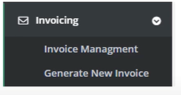
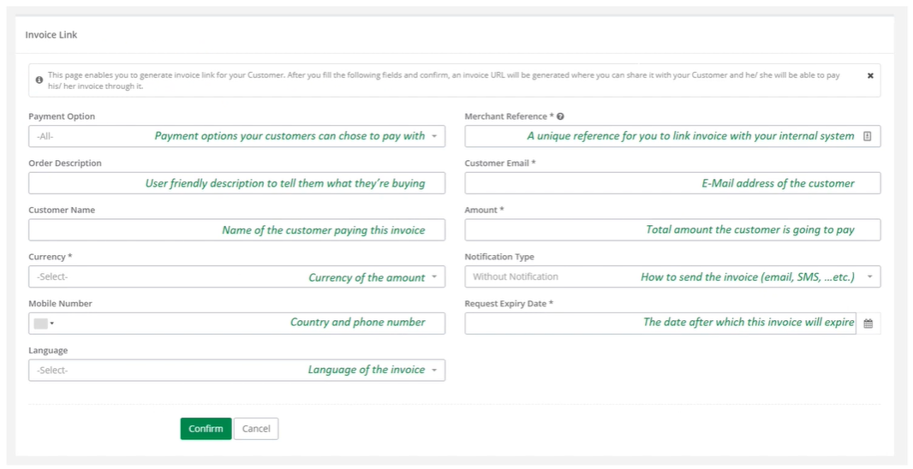
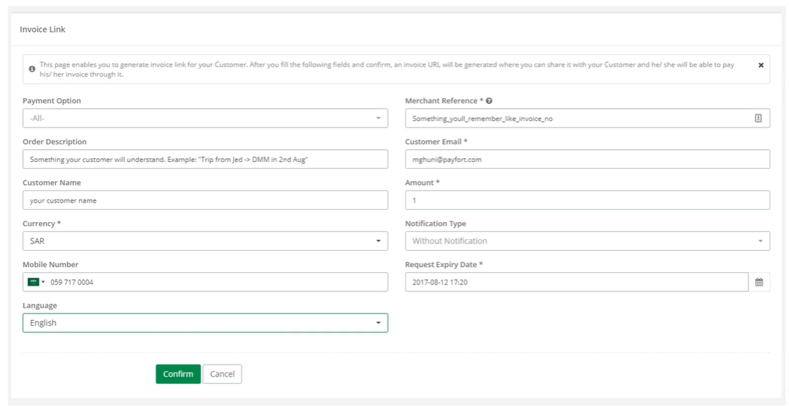
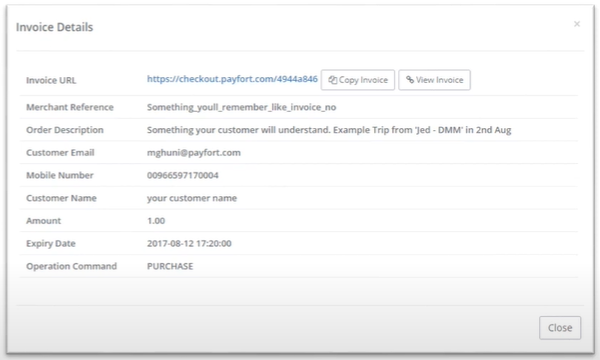
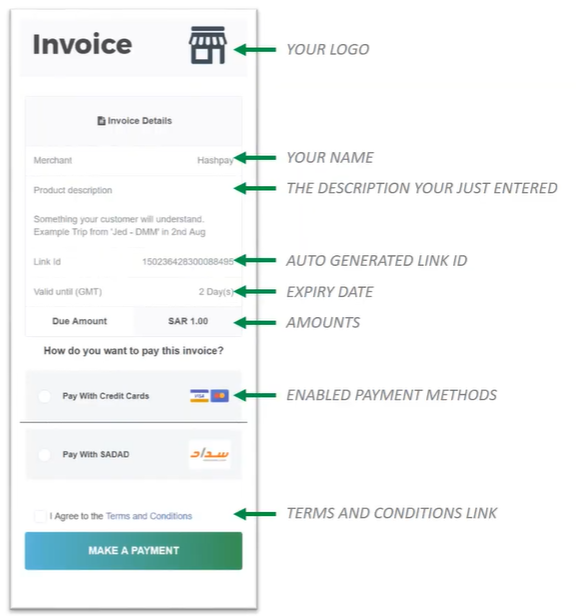
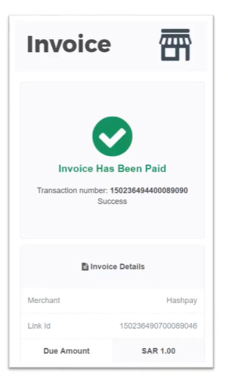
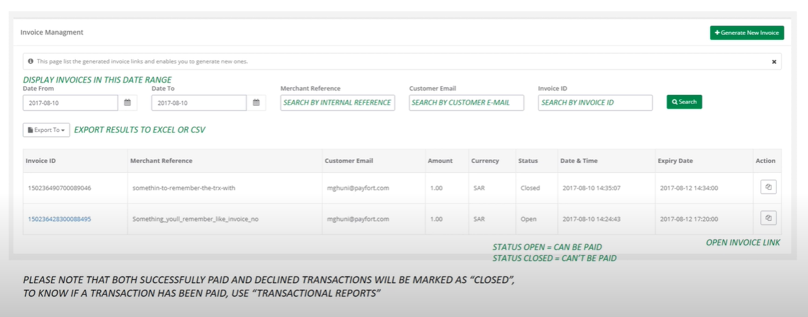

## Invoice generation (BackOffice)

------

You can also generate invoice through the PayFORT [BackOffice](https://fort.payfort.com/) portal. 

Please follow the steps to generate invoice through

    <ol>
        <li>Login to your PayFORT back office account.</li>
        <li>From the side menu click on invoices and then on Generate invoices.
            </li>
        <li>A new invoice form would open as shown below
            </li>
        <li>Create new invoice similar to the sample shown here
            </li>
  		<li>Success message will be displayed with the information you just entered and a button to copy the invoice link to send.
        </li>
        <li>Here is the sample invoice generate at the back office
        </li>
        <li>When invoice has been paid you will get the screen as shown here
        </li>
        <li>You can also generate and download reports of all the invoices from Invoice Management as shown here
        </li>
    </ol>

​        Please visit the following video tutorial to further understand the process.

    <iframe width="734" height="413" src="https://www.youtube.com/embed/q4Ggj2-9YuU" frameborder="0" allow="accelerometer; autoplay; encrypted-media; gyroscope; picture-in-picture" allowfullscreen></iframe>

## Go to Full API

------

Check out our full API by visiting this [link](https://docs.payfort.com/docs/api/build/index.html#redirection)

## Need further help?

Thanks for using PayFort.com. If you need any help or support, then message our support team at [support@payfort.com](mailto:support@payfort.com).

