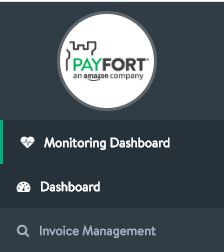
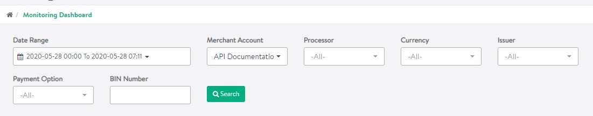
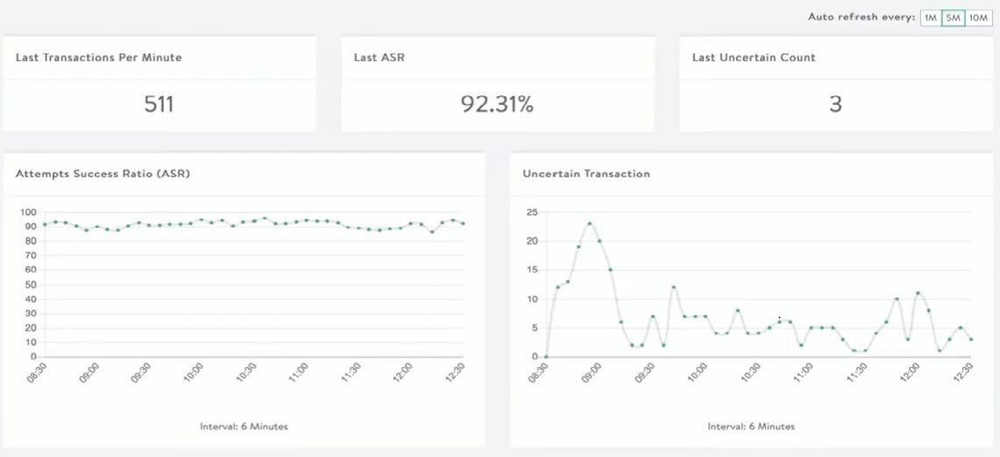
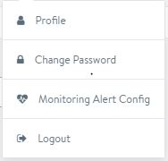
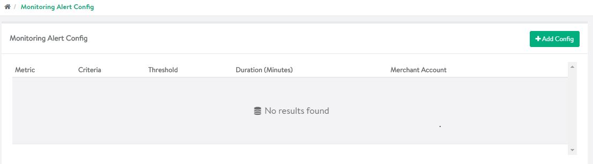

# Real Time Monitoring(RTM) through PayFORT BackOffice

------

The Monitoring Dashboard tool is a tool that allows you to track your account’s performance using multiple metrics. This tool provides real-time visibility to your account’s day-to-day performance. We recommend using this tool to monitor transactions for the period of one week.  

The profile types that can access RTM services are <mark><strong>Super Sub Merchant</strong></mark>, <mark><strong>Super Main Merchant</strong></mark>, <mark><strong>Merchant Financial User</strong></mark>.

------

### Steps to access RTM service

1. Login to your PayFORT account and click on <mark><strong>Monitoring Dashboard</strong> </mark>option on the left hand side of the screen.

   

2. Once the dashboard opens you will get a screen as shown below. 

   

3. You have to select from date range along with the option to select Merchant account, processor, currency, Issuer, Payment Option and Bin Number. 

4. Once you provide the required input and click on search option. It will provide you with various metrics as shown below.

   

   

   

   For more details on RTM services please watch this video.

 <iframe width="734" height="413" src="https://www.youtube.com/embed/zoQVMmOf61M" frameborder="0" allow="accelerometer; autoplay; encrypted-media; gyroscope; picture-in-picture" allowfullscreen></iframe>

<i class="fa fa-info">&nbsp;&nbsp;</i>The metrics are available only for the period of 30 days only.

### Configuring Monitoring Alerts

------

You can also configure your own monitoring alerts through the dashboard. Follow the steps to configure the same.

**Steps to configure monitoring alerts**

1. Click on your profile icon at the top right corner of the dashboard screen. A menu will be displayed as shown below.

   

   

2. Select Monitoring Alert Config option from the menu and you will be able to see the alert config dashboard as shown below

   

3. Click on Add config to configure your monitoring alert. Provide which metric you want to add to alert, criteria, threshold values, duration and the merchant account you want to monitor.

## Go to Full API

------

Check out our full API by visiting this [link](https://docs.payfort.com/docs/api/build/index.html#redirection)

------

## Need further help?

Thanks for using PayFort.com. If you need any help or support, then message our support team at [support@payfort.com](mailto:support@payfort.com).